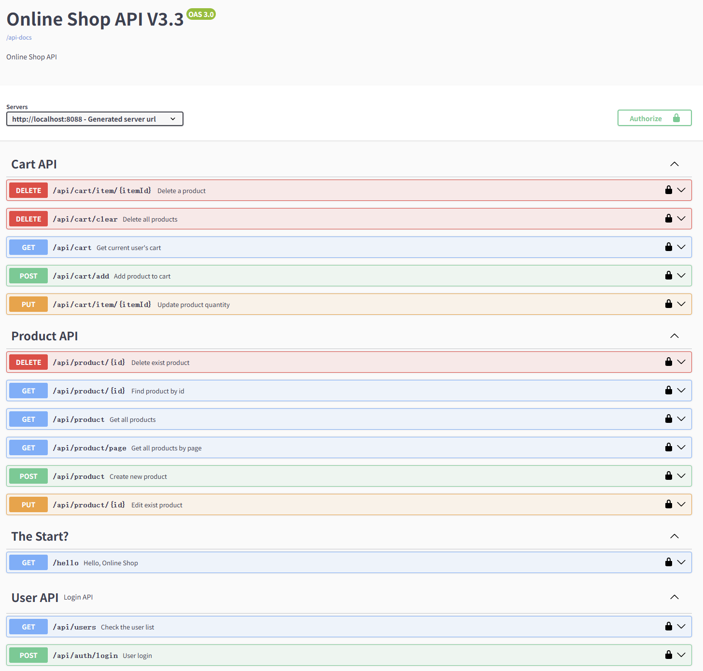

## Versions
- Java 17
- Spring Boot 3.5.4
- Spring Framework 6.1.13
- springdoc-openapi 2.5.0

## Technical Highlights
- JWT-based authentication flow
- Redis-optimized cart operations (5x faster read/write)
- Comprehensive exception handling & RESTful API design
- 85%+ unit test coverage (Controller/Service layers)
- Integrated H2 in-memory DB + Redis caching

## Tech Stack
# Category	       |  Technologies
                   |
- Backend	       |  Spring Boot 3.x
- Security	       |  Spring Security + JWT
- Database	       |  H2 (In-memory)
- Caching	       |  Redis
- API Docs	       |  Swagger/OpenAPI 3.0
- Build Tool	   |  Maven
- Testing	       |  JUnit 5 + Mockito
- Serialization	   |  Jackson

## Features
# User Authentication
  - JWT token generation/validation
  - Secure endpoint access control
# Product Management
  - CRUD operations
  - Paginated queries
# Shopping Cart
  - Add/remove items
  - Quantity updates
  - Cart clearance
  - Redis-backed implementation
# User Management
  - User list retrieval

## Quick Start
# Clone repository
git clone https://github.com/yourusername/online-shop.git
# Start Redis (ensure port 6379 available)
redis-server
# Build & run
mvn spring-boot:run
# Access application
http://localhost:8088

## API Documentation
- Access Swagger UI:http://localhost:8088/swagger-ui.html

## Running Tests
# Run all tests
mvn test

# Key test cases:
- ProductControllerTest: Product API tests
- JwtTokenUtilTest: Token validation tests
- ProductServiceTest: Service layer logic
- ProductControllerWithJwtTest: Secure endpoint tests